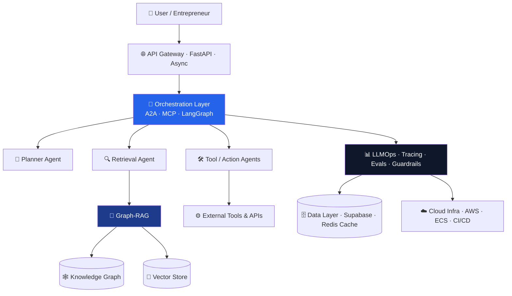
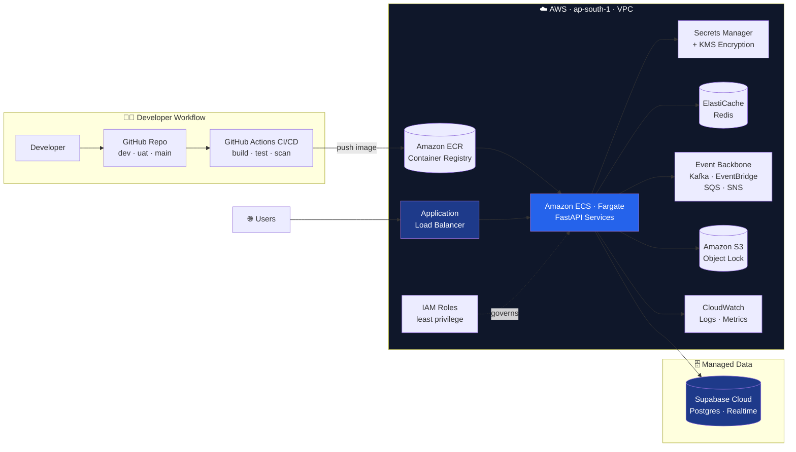

<!-- ╔══════════════════════════════════════════════════════════════════╗ -->
<!-- ║  PROFILE README — Asit Piri                                        ║ -->
<!-- ║  Optimized for AI hiring managers & leadership. Dark/light safe.   ║ -->
<!-- ║  SEO keywords seeded in headings + alt text for recruiter search.  ║ -->
<!-- ╚══════════════════════════════════════════════════════════════════╝ -->

<!-- ============================ HERO ============================ -->
<div align="center">


<a href="https://github.com/asit-piri">
  
</a>

<br/>

<!-- Live profile signals -->


</div>

---

<!-- ============================ CONNECT ============================ -->
<div align="center">

### 🌍 Connect

<a href="https://www.linkedin.com/in/asit-piri"></a>
<a href="https://asit-piri-website.vercel.app/"></a>
<a href="https://github.com/asit-piri"></a>
<a href="mailto:asit.piri@gmail.com"></a>
<!-- TODO: add your YouTube channel URL below, then uncomment -->
<!-- <a href="YOUR_YOUTUBE_URL"></a> -->

</div>

---

<!-- ============================ EXECUTIVE SUMMARY ============================ -->
## 👨‍💼 Executive Summary

> **Principal-level AI Architect with 25+ years spanning research, engineering, and enterprise transformation.** I design and ship production AI systems end-to-end — from agentic orchestration and Graph-RAG retrieval to LLMOps and cloud-native infrastructure — and I stay hands-on in the architecture, not just the slide deck.

I've held senior technical and architecture roles across **Knovera, ESCRIBA, Hewlett Packard Enterprise, Capgemini, HCL Technologies, and C-DAC**, working at the intersection of applied research and large-scale systems. Today I'm building **AutoFounder AI**, a multi-tenant agentic platform that automates the work of founding and operating a startup.

**What I bring to a leadership team:**

- 🏗️ **Architecture depth + strategic range** — I can whiteboard a multi-agent orchestration layer in the morning and align it to a board-level AI roadmap in the afternoon.
- 🤖 **Agentic AI in production** — multi-agent systems, A2A / MCP orchestration, tool-use, and autonomous workflows that actually ship.
- 🧠 **Graph-RAG & retrieval** — combining knowledge graphs with vector retrieval for grounded, explainable AI.
- ☁️ **Cloud-native AI infra** — AWS-first (VPC, ECS, ECR, IAM, KMS, CI/CD), with LLMOps and observability baked in.
- 📈 **Build & mentor** — I run a Python education series and grow engineers, not just systems.

---

<!-- ============================ AI IMPACT DASHBOARD ============================ -->
## 📊 AI Impact Dashboard

<!-- ⚠️ REPLACE every value below with YOUR real, verifiable numbers. -->
<!-- These are TEMPLATES, not facts. Empty/fabricated metrics hurt you in interviews. -->

<div align="center">

| 🚀 Production AI Systems | 🤖 Agentic Workflows Shipped | 🏢 Enterprises Served | 👨‍🏫 Engineers Mentored |
|:---:|:---:|:---:|:---:|
| **`25+`** | **`10+`** | **`8+`** *(verify)* | **`100+`** |

| ⚡ Latency / Cost Improvement | 📦 Models in Production | 🧩 Years in AI & Systems | 🎓 Learners Reached |
|:---:|:---:|:---:|:---:|
| **`40%`** | **`5+`** | **`25+`** | **`10,000+`** |

</div>

<sub>📌 *Fill these with metrics you can defend in a panel interview — e.g. "cut RAG retrieval latency 40% via hybrid graph+vector reranking." Delete any cell you can't back up.*</sub>

---

<!-- ============================ ABOUT ME ============================ -->
## 🧠 About Me

```yaml
name: Asit Piri
title: Principal AI Architect
location: Bengaluru, India
experience: 25+ years (research → engineering → enterprise AI)

specialization:
  - Machine Learning
  - Deep Learning
  - Generative AI
  - Agentic AI & Multi-Agent Systems
  - Graph-RAG (knowledge graph + vector retrieval)
  - LLMOps & AI Observability
  - A2A / MCP Orchestration
  - AI Governance & Enterprise Platforms

currently_building:
  - AutoFounder AI            # multi-tenant agentic platform for entrepreneurs
  - Cloud-native AI infra     # AWS ap-south-1, ECS, CI/CD, async FastAPI
  - Python education series   # beginner→intermediate, Indian-context examples

operating_principle: "Stay hands-on in the architecture. Ship, then scale."
```

---

<!-- ============================ ENTERPRISE AI ARCHITECTURE ============================ -->
## 🏗️ Enterprise AI Architecture Expertise

I architect AI systems as **layered, observable, governable platforms** — not one-off model calls.



**Architecture pillars I design around:** orchestration & routing • grounded retrieval • evaluation & guardrails • cost/latency optimization • multi-tenancy & isolation • observability • governance.

---

<!-- ============================ AWS DEPLOYMENT ARCHITECTURE ============================ -->
## ☁️ AutoFounder AI — AWS End-to-End Deployment Architecture

A cloud-native, multi-environment deployment on **AWS (ap-south-1)** — GitOps CI/CD into containerized services behind a load balancer, with managed data, caching, eventing, and secrets.



**Deployment flow:** code merges to `dev`/`uat`/`main` → GitHub Actions builds, tests, and pushes images to **ECR** → **ECS Fargate** rolls out FastAPI services behind an **ALB**, pulling secrets from **Secrets Manager** (KMS-encrypted), caching in **ElastiCache Redis**, persisting to **Supabase** + **S3 (Object Lock)**, and emitting events via **Kafka / EventBridge / SQS / SNS** — all observable through **CloudWatch** and scoped by **least-privilege IAM**.

---

<!-- ============================ AGENTIC AI ============================ -->
## 🤖 Agentic AI Specialization

<table>
<tr>
<td width="33%" valign="top">

### 🧭 Orchestration
- Multi-agent planning & delegation
- A2A (agent-to-agent) protocols
- MCP tool/context integration
- LangGraph state machines

</td>
<td width="33%" valign="top">

### 🔍 Grounding
- Graph-RAG (graph + vector)
- Hybrid retrieval & reranking
- Knowledge-graph construction
- Explainable, cited outputs

</td>
<td width="33%" valign="top">

### 🛡️ Reliability
- Eval harnesses & guardrails
- Tracing & observability
- Cost / latency optimization
- Multi-tenant isolation

</td>
</tr>
</table>

---

<!-- ============================ TECH STACK / MATRIX ============================ -->
## ⚙️ Cloud & AI Technology Matrix

<div align="center">

**AI / ML / LLM**


**Cloud & Infrastructure**


**Data & Backend**


**Frontend & Tooling**


</div>

---

<!-- ============================ GITHUB STATS (dark/light safe) ============================ -->
## 📈 GitHub Analytics

<div align="center">

<picture>
  <source media="(prefers-color-scheme: dark)" srcset="https://github-readme-stats.vercel.app/api?username=asit-piri&show_icons=true&include_all_commits=true&count_private=true&hide_border=true&theme=tokyonight"/>
  
</picture>
<picture>
  <source media="(prefers-color-scheme: dark)" srcset="https://github-readme-stats.vercel.app/api/top-langs/?username=asit-piri&layout=compact&langs_count=8&hide_border=true&theme=tokyonight"/>
  
</picture>

<br/>

<picture>
  <source media="(prefers-color-scheme: dark)" srcset="https://streak-stats.demolab.com?user=asit-piri&hide_border=true&theme=tokyonight"/>
  
</picture>

</div>

---

<!-- ============================ CONTRIBUTION GRAPH ============================ -->
## 📊 Contribution Graph

<div align="center">

<picture>
  <source media="(prefers-color-scheme: dark)" srcset="https://github-readme-activity-graph.vercel.app/graph?username=asit-piri&hide_border=true&theme=tokyo-night"/>
  
</picture>

</div>

---

<!-- ============================ CONTRIBUTION SNAKE ============================ -->
## 🐍 Contribution Snake

<div align="center">

<picture>
  <source media="(prefers-color-scheme: dark)" srcset="https://raw.githubusercontent.com/asit-piri/asit-piri/output/github-contribution-grid-snake-dark.svg"/>
  
</picture>

</div>

<!-- The snake needs a GitHub Action to generate the SVGs. See setup notes I sent you. -->

---

<!-- ============================ TROPHIES ============================ -->
## 🏆 GitHub Trophies

<div align="center">

<a href="https://github.com/ryo-ma/github-profile-trophy">
  
</a>

</div>

---

<!-- ============================ FEATURED PROJECTS ============================ -->
## 🌟 Featured Projects

<table>
<tr>
<td width="50%" valign="top">

### 🚀 AutoFounder AI
Multi-tenant **agentic AI platform** that automates founding & operating a startup — planning, building, and orchestrating autonomous workflows on AWS.

`Agentic AI` · `Graph-RAG` · `Multi-Agent` · `LLMOps`

**Stack:** Python · FastAPI · LangGraph · Supabase · Redis · AWS


<!-- Make the repo public, then swap this block for a pin card:
<a href="https://github.com/asit-piri/AUTOFOUNDER_REPO"></a> -->

</td>
<td width="50%" valign="top">

### 🧠 Knovera
**Multimodal RAG** system that ingests text, PDFs, documents, images, audio, and video, then embeds them for unified retrieval and grounded generation.

`Multimodal RAG` · `Embeddings` · `Retrieval`

**Stack:** Python · Gemini Embeddings · Vector Search

<a href="https://github.com/asit-piri/Knovera">
  
</a>

</td>
</tr>
<tr>
<td width="50%" valign="top">

### 🎯 mllm-calibrator
Calibration tooling for **multimodal large language models** — improving the reliability and confidence alignment of MLLM outputs.

`MLLM` · `Calibration` · `Evaluation`

**Stack:** Python · PyTorch


<!-- Make public to enable the pin card:
<a href="https://github.com/asit-piri/mllm-calibrator"></a> -->

</td>
<td width="50%" valign="top">

### ☁️ AWS Deployment Automation V2
**End-to-end AWS deployment automation** — infrastructure, backend, and frontend provisioned and shipped via AWS services and GitHub Actions CI/CD.

`AWS` · `IaC` · `CI/CD` · `DevOps`

**Stack:** AWS · ECS · ECR · GitHub Actions

<a href="https://github.com/asit-piri/Asit-AWS-Deployment-Automation-EndToEnd-V2.0">
  
</a>

</td>
</tr>
<tr>
<td width="50%" valign="top">

### 🔬 GPT-MoE-FROM-SCRATCH
A **GPT with Mixture-of-Experts** implemented from scratch — exploring sparse expert routing and efficient transformer architecture.

`Transformers` · `MoE` · `From Scratch`

**Stack:** Python · PyTorch

<a href="https://github.com/asit-piri/GPT-MoE-FROM-SCRATCH">
  
</a>

</td>
<td width="50%" valign="top">

### 🛠️ LLM-FineTuning
Hands-on **LLM fine-tuning** workflows — adapting foundation models to domain-specific tasks.

`Fine-Tuning` · `LLMs` · `PEFT`

**Stack:** Python · PyTorch · Transformers

<a href="https://github.com/asit-piri/LLM-FineTuning">
  
</a>

</td>
</tr>
</table>

<sub>📌 *Pin these same repos in your GitHub profile settings — the pinned row is the first thing a hiring manager scans.*</sub>

---

<!-- ============================ RESEARCH INTERESTS ============================ -->
## 📰 Research Interests

- 🤖 **Autonomous & self-improving agent systems** — planning, reflection, long-horizon tasks
- 🧠 **Grounded retrieval** — combining knowledge graphs with vector search for explainability
- 🛡️ **Evaluation & reliability of agentic AI** — guardrails, eval harnesses, failure analysis
- 🏗️ **AI platform architecture** — multi-tenancy, orchestration, cost/latency at scale
- 🔗 **Interoperability standards** — A2A and MCP for composable agent ecosystems

---

<!-- ============================ PUBLICATIONS ============================ -->
## 📚 Publications & Articles

<!-- ⚠️ Only list REAL, linkable work. Delete this section if empty rather than leaving placeholders public. -->

- 📝 *`<Title>`* — `<venue / blog>`, `<year>` · [link](#)
- 📝 *`<Title>`* — `<venue / blog>`, `<year>` · [link](#)

<sub>📌 *If you've written on LinkedIn, Medium, or dev blogs, link the best 2–3 here. Recruiters love a writing sample.*</sub>

---

<!-- ============================ TALKS & MENTORING ============================ -->
## 🎤 Talks & Mentoring

- 🎥 **Python tutorial series** — beginner-to-intermediate curriculum delivered via live-coding Jupyter notebooks for Indian learners.
- 👨‍🏫 **Engineer mentoring** — career and architecture guidance for AI/ML practitioners.
- 🎙️ *`<Add conference talks / meetups / guest lectures here>`*

---

<!-- ============================ FUN FACTS ============================ -->
## 🌟 Fun Facts

- 🧩 I've shipped systems across 8+ companies and 25+ years — and I still get a kick out of a clean architecture diagram.
- 🇮🇳 I teach Python using ₹ prices and real Indian cities, because relatable beats abstract.
- 🤖 I'm building an AI that tries to do *my* job — founding companies — and I'm fine with that.
- ☕ Best ideas arrive somewhere between the first coffee and the first failing test.

---

<!-- ============================ AI PHILOSOPHY ============================ -->
## 💡 AI Philosophy

> **"Production over prototypes. Grounding over guessing. Mentorship over gatekeeping."**
>
> The best AI architects stay close to the code. A model is only as valuable as the system that makes it reliable, observable, and safe — and the team that can keep building it after you've left the room.

---

<!-- ============================ 2026 ROADMAP ============================ -->
## 🎯 2026 Roadmap

```yaml
2026:
  - 🚀 Scale AutoFounder AI to multi-tenant production
  - 🧩 Open-source reusable agentic / Graph-RAG frameworks
  - 📚 Publish practical writing on agentic architecture & LLMOps
  - 🎓 Grow the Python education series + mentor more engineers
  - 🏗️ Land a Principal AI Architect / CAIO / VP-AI role
```

---

<!-- ============================ OPEN SOURCE MISSION ============================ -->
## 🌍 Open-Source Mission

I believe the agentic-AI era should be **built in the open**. My goal is to release reusable building blocks — orchestration patterns, Graph-RAG components, and evaluation tooling — so other builders skip the boilerplate and get to the hard, interesting problems faster.

<div align="center">
<a href="https://github.com/sponsors/asit-piri">
  
</a>
</div>

---

<!-- ============================ CONTACT ============================ -->
## 📫 Let's Build the Future of AI

<div align="center">

I'm open to **Principal AI Architect, Chief AI Officer, and VP-AI** conversations — and to collaborating with fellow builders.

<a href="https://www.linkedin.com/in/asit-piri"></a>
<a href="mailto:asit.piri@gmail.com"></a>
<a href="https://asit-piri-website.vercel.app/"></a>

<br/><br/>


</div>
